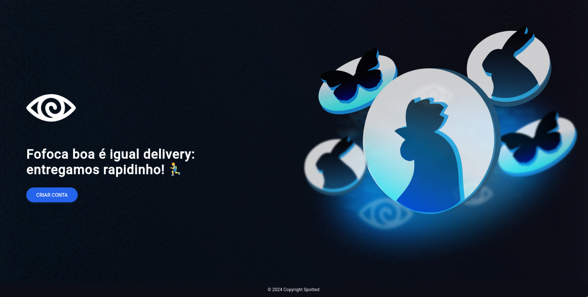

# Spotted Front-End

Este é o repositório do front-end de uma aplicação de rede social desenvolvida com Angular.

## Imagens do Projeto

Aqui estão algumas imagens do projeto:




## Clonando o Repositório

Para começar, clone este repositório em sua máquina local:

```bash
git clone https://github.com/Dor-de-Cabeca-Team/Rede-Social-Front-End.git
cd Rede-Social-Front-End/spotted
```

## Instalando as Dependências

No diretório do projeto, instale as dependências necessárias:

```bash
npm install
```

## Pré-requisitos

- Certifique-se de que o projeto do back-end [Rede Social Back-End](https://github.com/Dor-de-Cabeca-Team/Rede-Social-Back-End.git) esteja em execução antes de iniciar o front-end.
- É necessário ter a **versão 17 do Angular** instalada em sua máquina para garantir a compatibilidade do projeto.

## Executando o Projeto

Após instalar as dependências e garantir que o back-end esteja rodando, inicie o servidor de desenvolvimento com:

```bash
ng serve
```

---

Certifique-se de ter o Angular CLI atualizado para a versão 17 com o comando:

```bash
npm install -g @angular/cli@17
```

Dessa forma, o projeto funcionará corretamente.
